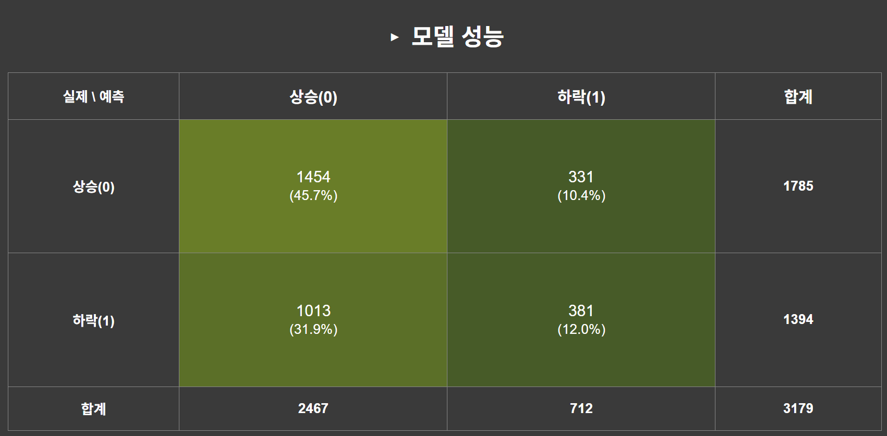
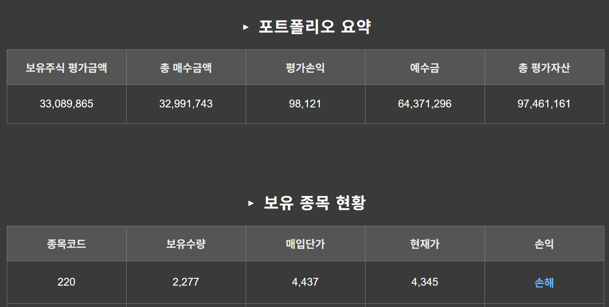

# 딥러닝(GRU)과 AWS를 활용한 투자 시스템 구축 프로젝트
> 서울과학기술대학교 전기정보공학과 졸업 캡스톤 디자인 프로젝트 (2025.02 ~ 2025.10)

 

## 1. 프로젝트 소개 🚀

본 프로젝트는 딥러닝 모델(GRU)을 활용하여 투자 전략을 수립하고, 이를 사용자가 웹에서 확인할 수 있도록 Flask 기반의 UI로 구현하여 AWS 클라우드 환경에 배포한 **Full-Cycle 프로젝트**입니다.

모델 개발뿐만 아니라, 백엔드 API 서버 구축, UI 시각화, 그리고 클라우드 배포까지의 전 과정을 경험하며 시스템 아키텍처에 대한 이해를 높이는 것을 목표로 했습니다.

 

## 2. 주요 기능 🎯

* 시계열 데이터(주가, 거래량 등)를 활용한 GRU 모델 학습
* 학습된 모델을 기반으로 한 투자 시그널 (매수/매도) 생성
* Flask 웹 서버를 통한 투자 결과 및 백테스팅 결과 시각화
* AWS EC2 환경에서의 24시간 서비스 운영

 

## 3. 기술 스택 🛠️

* **Backend**: `Python`, `Flask`
* **Deep Learning**: `GRU` , `Pandas`, `Numpy`, `Scikit-learn`
* **Deployment**: `AWS EC2`
* **[기타]**: `MySQL`

 

## 4. 시스템 아키텍처 🏛️

1.  **데이터 수집**: [데이터 출처, 예: KRX API, 야후 파이낸스]에서 투자 대상 데이터를 수집 및 전처리
2.  **모델 학습**: 정제된 데이터를 바탕으로 GRU 딥러닝 모델 학습
3.  **API 서버 (Flask)**: 학습된 모델을 로드하여, 특정 요청이 오면 예측 결과를 반환하는 API 구현
4.  **UI (Flask Templates)**: API로부터 받은 데이터를 렌더링하여 사용자에게 차트나 테이블 형태로 시각화
5.  **배포 (AWS)**: AWS EC2 인스턴스에 Flask 애플리케이션을 배포하여 외부에서 접근 가능하도록 구성

 

## 5. (선택) 프로젝트 실행 화면 📸

 

## 7. 배운 점 및 향후 계획 🧑‍💻

**배운 점:**
* 단순한 모델 개발을 넘어, Flask를 이용한 백엔드 API 서버 구축과 AWS EC2 배포까지 경험하며 서비스의 전체 파이프라인을 이해할 수 있었습니다.

**향후 계획:**
* 현재 Flask로 구현된 서버를 Spring Boot 기반으로 마이그레이션하여, 대규모 트래픽에도 견딜 수 있는 안정적인 백엔드 시스템으로 고도화할 계획입니다.
